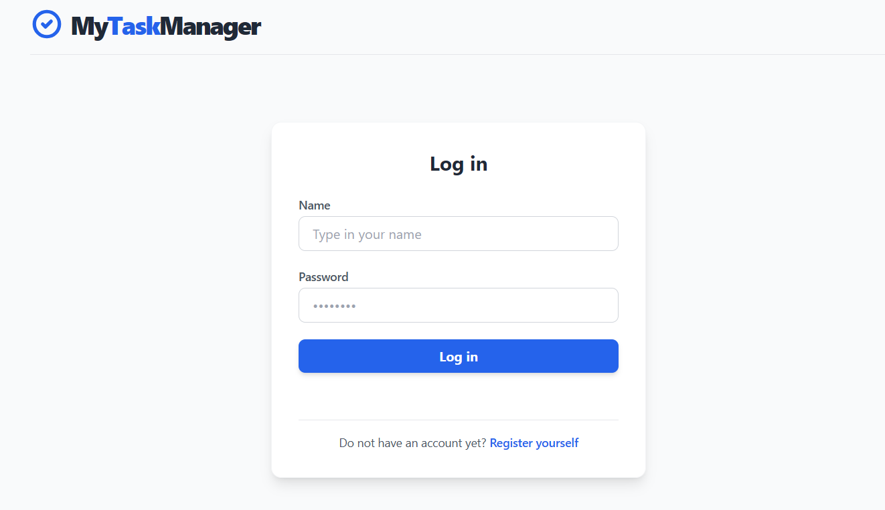
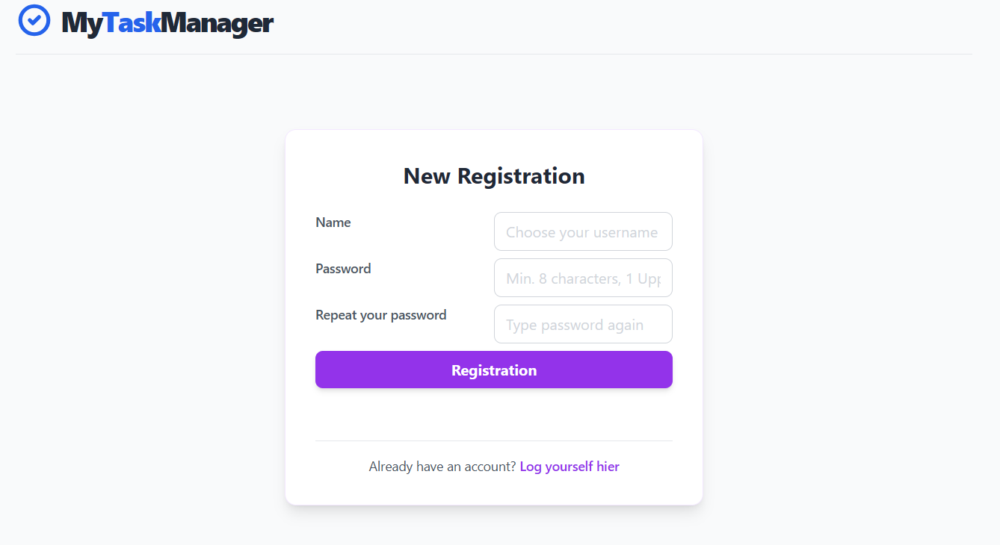
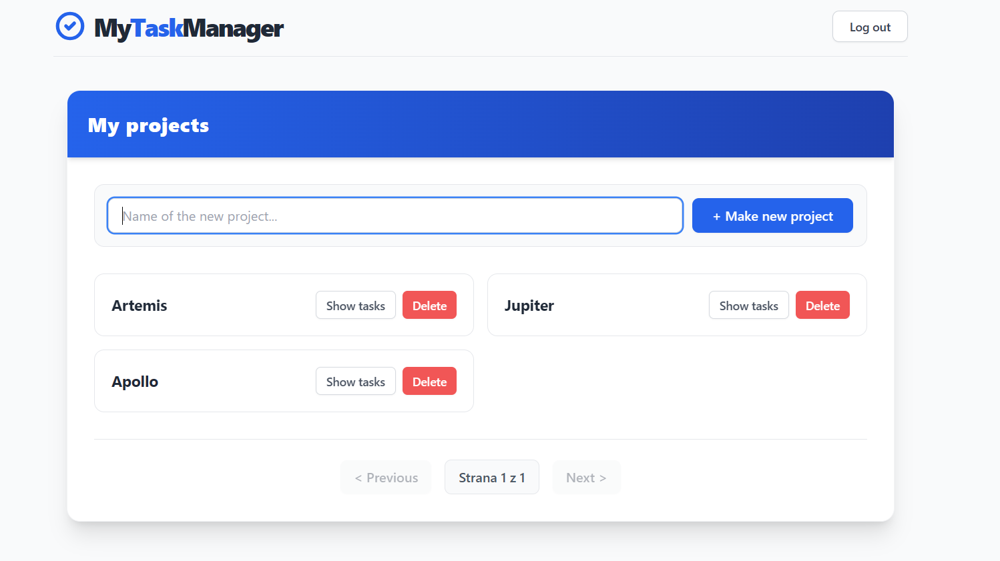
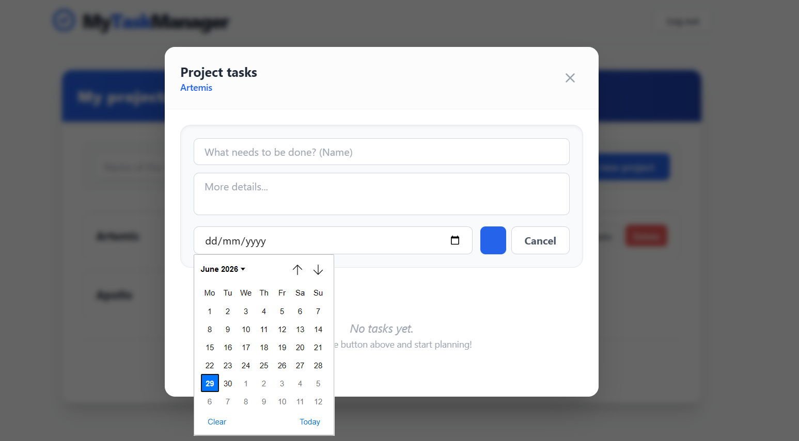

# 🚀 My Task Manager

A full-stack, secure, and responsive Task Management application built to efficiently organize projects and daily tasks. It features a robust Spring Boot backend with advanced security mechanisms and a modern, lightning-fast React frontend powered by Vite and Tailwind CSS.

## ✨ Key Features

* **🔐 Advanced Security & JWT Auth:** Secure stateless authentication using JSON Web Tokens (io.jsonwebtoken).
* **🛡️ Brute-Force Protection:** Custom `LoginAttemptService` that tracks failed login attempts and temporarily locks accounts to prevent brute-force attacks.
* **👥 Role-Based Access Control (RBAC):** Distinct roles for `USER` and `ADMIN`. Admins have exclusive access to a secure dashboard for user management.
* **🗂️ Server-Side Pagination:** Optimized data fetching using Spring Boot's pagination features, ensuring fast load times even with a large number of projects.
* **🎨 Modern UI/UX:** A clean, responsive, and intuitive user interface styled completely with Tailwind CSS.

---

## 🛠️ Tech Stack

### Frontend
* **Framework:** React (Bootstrapped with Vite)
* **Styling:** Tailwind CSS
* **Routing:** React Router (Conditional Rendering)

### Backend
* **Core:** Java 17+, Spring Boot 3.x
* **Security:** Spring Security, JWT (JSON Web Tokens)
* **Database:** PostgreSQL
* **ORM:** Spring Data JPA / Hibernate

---

## 🏗️ Architecture Highlights

### Security Flow
1. Users register with a secure, encoded password (BCrypt).
2. Upon successful login, the server issues a JWT token and returns the user's `Role` (e.g., `USER` or `ADMIN`).
3. The React frontend stores the token in `localStorage` and attaches it to the `Authorization` header (`Bearer <token>`) for subsequent API requests.
4. The Spring `JwtAuthenticationFilter` intercepts requests, validates the token, and sets the Security Context.

### Admin Dashboard (RBAC)
The application includes dedicated endpoints (e.g., `/api/admin/users`) secured via Spring Security's `.hasRole("ADMIN")`. The frontend dynamically renders the Admin Panel only if the decoded role from the server grants permission.

---

## 🚀 Getting Started

Follow these instructions to set up the project locally on your machine.

### Prerequisites
* [Node.js](https://nodejs.org/) (v18+ recommended)
* [Java JDK](https://www.oracle.com/java/technologies/javase-downloads.html) (17 or higher)
* [PostgreSQL](https://www.postgresql.org/)
* Maven

### 1. Database Setup
1. Open pgAdmin or your preferred database tool.
2. Create a new PostgreSQL database named `taskmanager` (or update the name in `application.properties`).
3. The tables will be automatically generated by Hibernate on the first run.

### 2. Backend Setup
1. Navigate to the backend directory:
   ```bash
   cd taskmanager
   
### Example Screenshots



